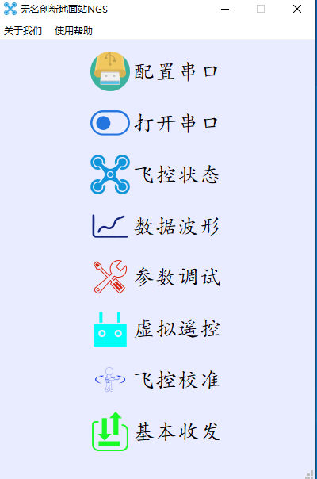
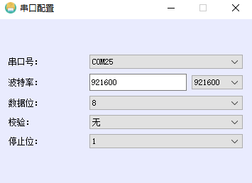
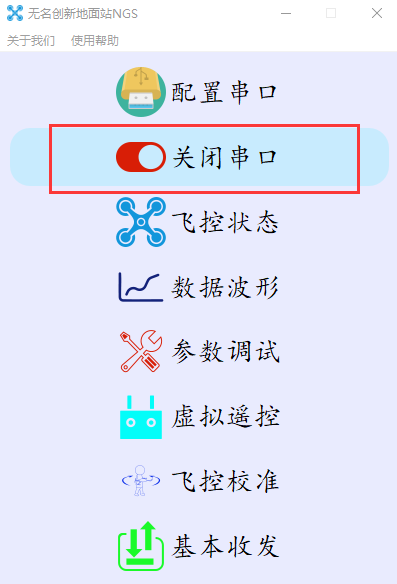
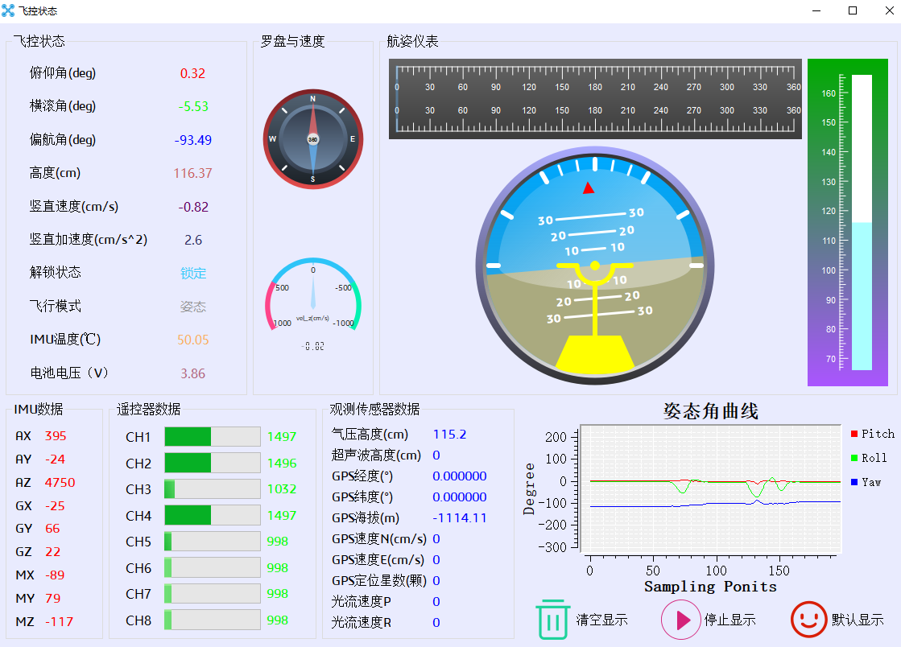
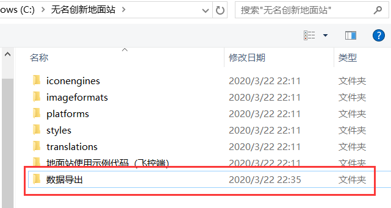
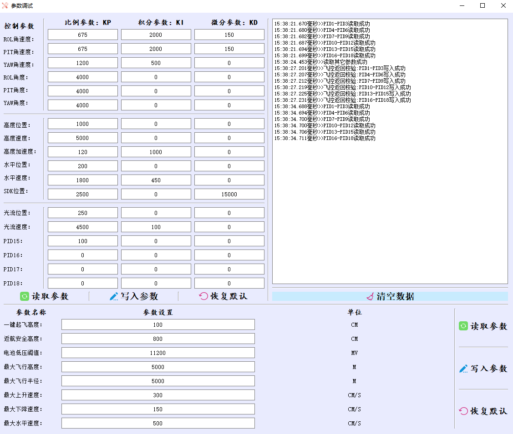
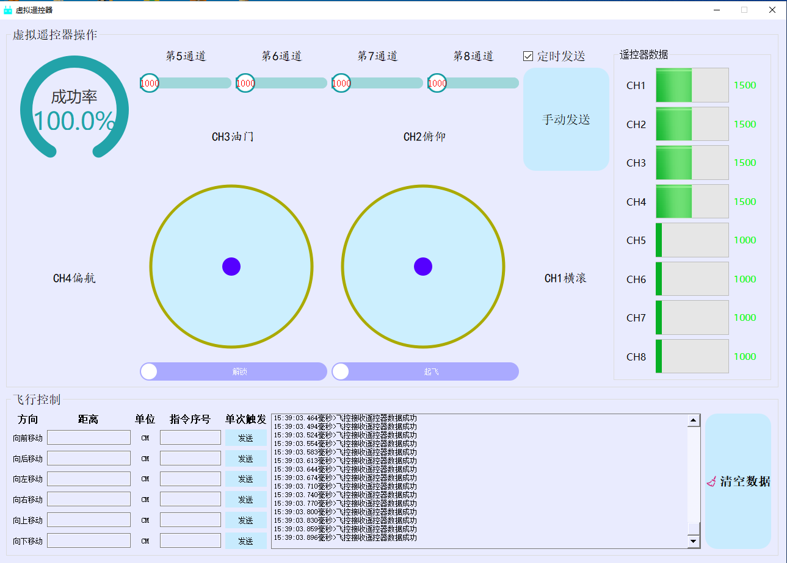
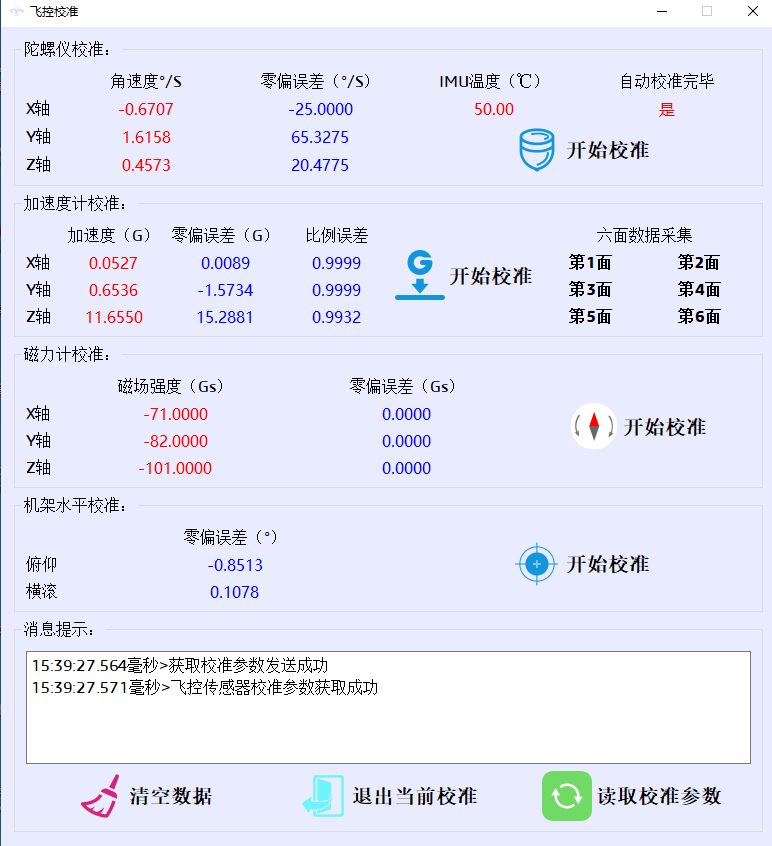
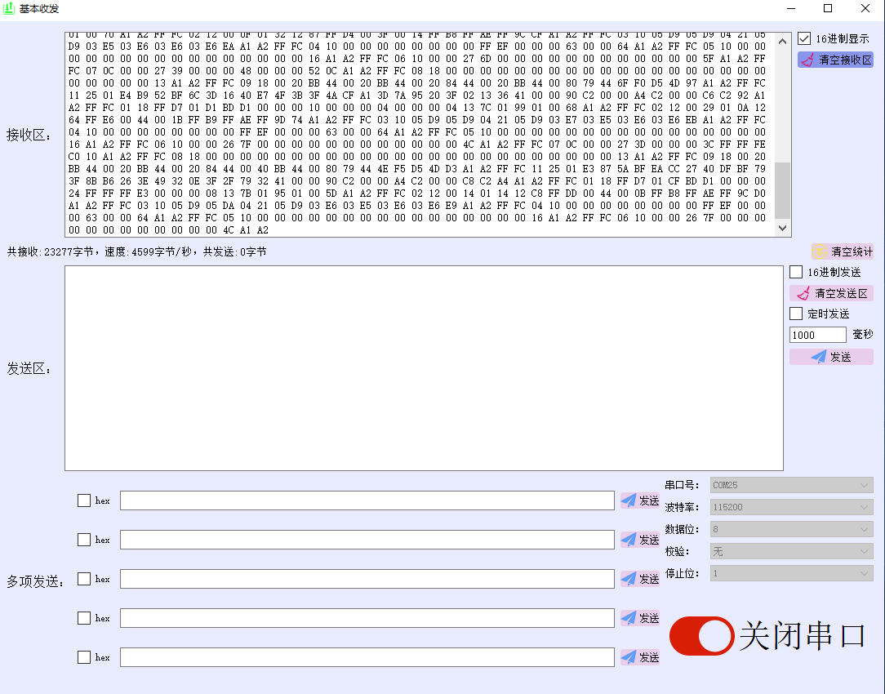

# 无名创新飞控开源地面站——NGroundStation

## 一、地面站开源初衷与下载链接：

​        无名创新飞控开源飞控地面站是无名小哥为广大自研飞控开发者、电子发烧友们专门开发的一款多功能上位机软件，地面站功能涵盖：飞控状态显示、数据波形、参数调试、虚拟遥控器、飞控传感器校准串口助手常用等，开发此款地面站的初衷是方便大家高效学习与调试。

​        初学者在学习无人机飞控相关算法选择地面站时，个人小众开发者设计的地面站，在功能和性能上各有优缺点，无法兼容常用功能，而针对APM/PX4的开源地面站MP与QGC功能复杂，很多冗余的功能用不上，开发者需要自行移植并裁剪Mavlink协议来适配自己的飞控，导致开发者往往为选择一款合适的地面站而发愁，为兼容不同家地面站需要花一定功夫。

​        考虑到目前国内没有一家开源飞控地面站软件代码开源出来给大家学习，为了做到初学者也能简单高效的开发出满足自己需要的地面站软件，无名小哥选择采用QT开发平台，基于C++图形用户界面开发了此地面站软件，整个工程代码框架清晰，每个功能模块单独封装，注释详尽，使得有一定编程经验的初学者能对整个地面站软件运行逻辑一目了然，并能基于我们开源的地面站软件进行二次开发，后续会上线更多功能，地面站软件持续更新，欢迎大家公测，只要您是为了整个开源生态的建设，批评指正，拍砖打脸没关系。下面来依次介绍本地面站功能。

##### 无名地面站下载：http://www.nameless.tech/download.html

##### 开源地面站NGroundStation使用教程：https://www.bilibili.com/video/BV1JE411c7vU?from=search&seid=4801164549946953127

##### 无名创新开源地面站交流QQ群：465082224、540707961

##### 无名地面站开源代码下载链接在文末

## 二、开源地面站的使用

### 2.1、主界面介绍与串口配置

​        无名创新地面站发布采用免安装的方式，用户在官方下载地面站后，直接解压后点击NGroundStation.exe运行即可，同路径文件夹下后缀为.dll依赖库文件不得随意删除，否则点击运行时，会报缺少xxx.dll文件。

​         用户打开地面站后进入如下主界面，导航栏有无名创新团队介绍与软件使用帮助，主界面有各个功能模块。首先第一步先点击配置串口：

​        点击后软件会自动搜索当前电脑可用的串口设备（USB转TTL设备、USB虚拟串口VCP、RS232/485等）,若系统上没有可用设备时，软件会提示界面如下，此时请检查您的电脑有相关串口外设设备或者查看设备管理器是否有对应外设驱动。

​        软件会自动搜索当前可用串口设备，搜索出的串口号为对应外设的设备号，当存在多个串口设备时，需要自行勾选需要连接的串口。常用波特率可以通过波特率设置行下拉选择，同时若需要调试其它非常规设备，也支持手动输入任意波特率，手动输入时输入完毕后请点击电脑回车键进行输入确认，不点击回车键直接退出为无效输入。设置好串口设备后，退出设置界面。在主界面点击打开串口后地面站解析数据即开始工作。

​        飞控状态、数据波形、参数调试、虚拟遥控、飞控校准功能都是建立在地面站正常解析飞控数据的前提下，故当上述功能界面不能正常使用时，请回头检查串口配置和串口是否已经打开/占用。

### 2.2、飞控状态显示

​        飞控状态显示界面分飞控基本状态、罗盘与速度、航姿仪表、IMU数据、遥控器数据、观测传感器数据、姿态角度曲线等模块。用户可以通过地面站实时可视化观察无人机的常用状态。用户可以根据状态提示来了解无人机的各个参数。

### 2.3、数据波形显示

​          数据波形显示界面可以动态观察无人机关键状态的数据波形曲线，如分析各个传感器数据、姿态数据、惯导数据、控制指令等数据，在自己研究对比飞控算法性能、滤波器参数整定、突发故障异常分析过程中非常实用。无名创新地面站预留了6组用户数据通道可以供客户自行发送数据。数据波形支持导入\导出，文件名为电脑系统时间精确到S，导出的csv格式数据可以很方便的用数值处理软件如Matlab、Origin等做后续数据处理分析。

### 2.4、参数调试

​        自研飞控开发者在学习过程中需要对结合不同的动力装对飞控PID参数进行调整，来确保无人机拥有稳定的飞行性能，关键参数为姿态内环—角速度环参数，主要工作是对角速度环PID参数进行整定，主PD，辅积分参数I。参数调试界面后，各个参数框中均为0，先点击读取参数，地面站会发送获取参数指令给飞控，地面站获取到飞控发上来的参数后会刷新UI界面显示当前飞控内部参数，需要调整参数时，手动在对应参数框中输入设定参数，点击写入参数后，飞控即保存参数于FLASH/EEPROM中，下次上电飞控会自动从FLASH/EEPROM中读取参数值。同理对飞控其它参数的设置过程也一样，先读取，更改后点击写入。当用户想要恢复默认初始参数时，点击恢复默认参数即可。用户在设置参数写入、恢复过程中，飞控会返回操作是否成功的应答给地面站显示写入状态。

### 2.5、虚拟遥控

​        虚拟遥控器界面模拟了8通道双回中式遥控器数据，默认以左手油门的形式发送1-8通道数据，本功能可以在在无遥控器操作下，解锁上锁电机、测试无人机电调行程，若要在实际飞行中运用该功能，需要保障所有数传模块在当前实用条件下通讯可靠。地面站在发送数据的同时，接收了飞控解析数据正常的回传数据，并计算通讯的成功率，地面站每20ms发送一次遥控器数据，飞控端在20ms内返回应答一次算一次通讯正常，若飞控端回传应答频率小于50HZ，实际又可能造成通讯没有异常，但地面站获取的成功率小于100%的情况。同时设计了飞行指令控制功能，即通过指令控制无人机空间的位移方向与距离。

### 2.6、飞控校准

​        入手飞控第一步就是传感器校准，打开飞控校准界面，有四种和传感器相关的校准操作，其中陀螺仪校准和机架水平校准不需要人为操作飞行器，保持无人机静置与水平面，点击校准按键即自动进行。飞行器对陀螺仪的校准是每次飞控上电工作均会自动进行一次，即飞控IMU温度升温到50℃后，若此时飞行器保持静止，陀螺仪会自动校准偏移，地面站也加入了人为校准陀螺仪偏移，点击开始校准陀螺仪后，飞控会自动再次校准陀螺仪零偏。

​        飞控加速度校准采用和APM/PX4一致的6面校准法，首先点击加速度校准进入，随后点击对应面按钮，每一面会提示如何放置飞行器。6面数据都采集完毕后，飞控会计算校准参数并发送到地面站。

​         磁力计校准采用椭球拟合的方式，实际需要采集3个面内36角点数据，飞控自带显示屏会提示每一面如何放置并旋转，显示屏上有显示每个角点数据采集状态，三个面所有角点采集完毕后，会计算校准参数并发送到地面站。

​        机架水平校准主要目的是针对飞控安装在机架上与水平面之间的夹角误差，因此需要结合水平仪来进行操作，实用中将飞控安装在机架上后，首先校准加速度计，然后将水平仪放置在机架所在平面，调整机架脚架使得水平仪气泡居中，再进行机架水平校准操作。

​      其它按键获取校准参数、退出当前校准等不赘述，上述所有校准中，除磁力计骄傲，其它均需要温控系统稳定工作后，因此最好等温度达到50°并且稳定后，再开始进行陀螺仪、加速度、机架水平的校准操作。无名飞控对飞控校准均保留遥控器直接校准的方式，因此用户可以结合实际场景，灵活确定，遥控器校准传感器视频教程如下。

##### **1、加速度校准教程：https://www.bilibili.com/video/BV1it411k7CJ?from=search&seid=255111440291059640*

##### *2、磁力计校准：https://www.bilibili.com/video/BV1it411k7CC?from=search&seid=15429067159432134560*

##### *3、机架水平校准：https://www.bilibili.com/video/BV1L4411E7j2?from=search&seid=14438186151189674967*

### 2.7、基本收发

​        地面站保留了普通串口调试助手的功能，这一项是和上述功能区分开的，可以作为普通串口调试助手实用，数据以文本/16进制收发，定时自动发送、多项指令发送等。

# 三、地面站软件代码开源

## 3.1 QT开发环境

链接：https://pan.baidu.com/s/1R__jn921zaPGsYB2VQV3mQ 提取码：hgo7

## 3.2 第三方支持包，自行网上搜索教程安装

### QWT6.1.3：https://qwt.sourceforge.io/

链接：https://pan.baidu.com/s/1W2UUki_e73pQ7X-7qgs5Fw 提取码：x1aj

### QUC自定义控件：http://www.qtcontrol.cn/

链接：https://pan.baidu.com/s/1s9gpVaawuqrKXAXMFsIvWQ 提取码：dyxq

## 3.3 无名创新地面站源码下载

#### Github下载链接：https://github.com/wustyuyi/NGroundStation

#### 欢迎mark加star，小伙伴们赶快加入我们吧！！！

#### 感谢您的支持，地面站开发教程与更多功能敬请期待！！！

#### 为广大开发者提供地面站二次开发交流平台，微信扫描加入知识星球：

